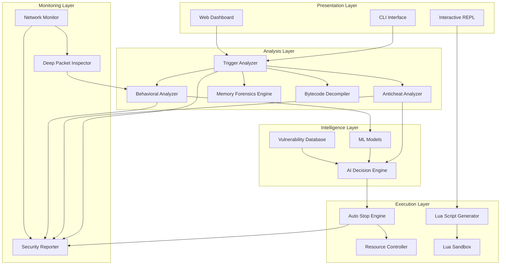
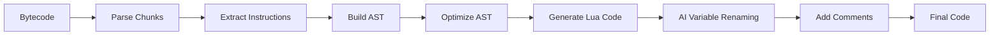

# Design Document: Ambani Integration

## Overview

Este documento define el diseño técnico de la integración de RED-SHADOW v4.0 con la API Lua de Ambani para crear una plataforma avanzada de análisis de seguridad para servidores FiveM. El sistema combina análisis estático, testing de penetración automatizado, machine learning, análisis forense de memoria, y monitoreo de red en tiempo real para identificar y mitigar vulnerabilidades explotables.

### Objetivos del Sistema

1. **Análisis Integral**: Detectar todos los vectores de ataque explotables por Ambani mediante análisis multi-capa
2. **Protección Automática**: Detener recursos vulnerables automáticamente usando ML y análisis de riesgo
3. **Adaptabilidad**: Detectar anticheats activos y adaptar estrategias de análisis para evitar detección
4. **Inteligencia Artificial**: Usar IA para tomar decisiones óptimas sobre estrategias de explotación
5. **Análisis Forense**: Decompilación de bytecode, análisis de memoria, y detección de malware
6. **Monitoreo en Tiempo Real**: Captura y análisis de tráfico de red para detectar explotación activa

### Alcance

El sistema extiende RED-SHADOW v4.0 con capacidades específicas para:
- Análisis de triggers y eventos explotables por Ambani
- Control seguro de recursos FiveM con auto-detención inteligente
- Generación automática de scripts Lua para testing de penetración
- Detección y perfilado de anticheats (FiveGuard, Phoenix AC, WaveShield)
- Análisis de comportamiento con ML (Isolation Forest, One-Class SVM, Autoencoders)
- Decompilación de bytecode Lua y archivos .fxap
- Deep Packet Inspection de tráfico FiveM
- Motor de decisiones basado en IA (A*, MCTS, game theory)

### Restricciones

- **Legalidad**: El sistema solo debe usarse con autorización explícita del propietario del servidor
- **Safe Mode**: Todas las operaciones destructivas deben operar en modo seguro con rollback
- **Compatibilidad**: Debe mantener compatibilidad con el workflow existente de RED-SHADOW
- **Performance**: El análisis no debe degradar el rendimiento del servidor objetivo
- **Recursos Críticos**: Nunca detener recursos esenciales (es_extended, qb-core, oxmysql, txAdmin) sin confirmación

## Architecture

### Arquitectura de Alto Nivel

El sistema sigue una arquitectura modular de 5 capas:



### Flujo de Datos Principal

1. **Fase de Análisis Estático**:
   - Dump Analyzer procesa el volcado del servidor FiveM
   - Trigger Analyzer identifica eventos, callbacks, exports, y natives
   - Anticheat Analyzer detecta y perfila anticheats activos
   - Bytecode Decompiler decompila código ofuscado y .fxap
   - Memory Forensics Engine analiza snapshots de memoria

2. **Fase de Análisis Inteligente**:
   - Behavioral Analyzer usa ML para detectar anomalías
   - AI Decision Engine genera estrategias de explotación óptimas
   - Vulnerability Database proporciona firmas de exploits conocidos
   - ML Models calculan Risk_Score, Stop_Confidence_Score, Anomaly_Score

3. **Fase de Ejecución**:
   - Lua Script Generator crea scripts de testing basados en estrategia de IA
   - Lua Sandbox ejecuta código sospechoso en entorno aislado
   - Resource Controller detiene recursos vulnerables según decisiones de Auto Stop Engine
   - Network Monitor captura tráfico en tiempo real durante testing

4. **Fase de Reporte**:
   - Security Reporter agrega resultados de todas las capas
   - Genera reportes JSON/HTML con visualizaciones
   - Incluye proof-of-concepts, recomendaciones, y código de parches

### Patrones Arquitectónicos

- **Strategy Pattern**: AI Decision Engine selecciona estrategias de análisis basadas en Anticheat Profile
- **Observer Pattern**: Network Monitor notifica a Behavioral Analyzer sobre eventos de red
- **Command Pattern**: Resource Controller ejecuta operaciones con rollback
- **Factory Pattern**: Lua Script Generator crea scripts específicos por tipo de exploit
- **Singleton Pattern**: Vulnerability Database mantiene estado global
- **Chain of Responsibility**: Análisis multi-capa procesa triggers secuencialmente

## Components and Interfaces

### 1. Trigger Analyzer

**Responsabilidad**: Análisis estático de código Lua para identificar vectores de ataque explotables por Ambani.

**Interfaces**:
```python
class TriggerAnalyzer:
    def analyze_dump(self, dump_path: str) -> AnalysisResult:
        """Analiza un volcado de servidor y retorna vulnerabilidades detectadas"""
        
    def calculate_risk_score(self, trigger: Trigger) -> int:
        """Calcula Risk_Score (0-100) basado en múltiples factores"""
        
    def detect_exploit_vectors(self, triggers: List[Trigger]) -> List[ExploitVector]:
        """Identifica vectores de ataque específicos de Ambani"""
        
    def detect_honeypots(self, triggers: List[Trigger]) -> List[Honeypot]:
        """Detecta trampas y honeypots mediante análisis de patrones"""
        
    def analyze_obfuscation(self, code: str) -> ObfuscationAnalysis:
        """Analiza técnicas de ofuscación y calcula dificultad de deofuscación"""
```

**Algoritmo de Risk_Score**:
```
Risk_Score = (
    validation_score * 0.30 +      # Ausencia de validación de source
    reward_logic_score * 0.25 +    # Lógica de recompensas (dinero, items)
    dangerous_natives_score * 0.25 + # Uso de natives peligrosas
    rate_limiting_score * 0.20     # Ausencia de rate limiting
)

Donde cada componente está en rango [0, 100]
```

**Categorización de Severidad**:
- CRITICAL (Risk >= 70): Dinero, items, admin, god mode
- HIGH (Risk >= 50): Teleport, armas, vehículos
- MEDIUM (Risk >= 30): Información sensible, posición
- LOW (Risk < 30): Cosméticos, UI

### 2. Anticheat Analyzer

**Responsabilidad**: Detección y perfilado de sistemas anti-cheat activos.

**Interfaces**:
```python
class AnticheatAnalyzer:
    def detect_anticheats(self, code_base: CodeBase) -> List[AnticheatProfile]:
        """Detecta anticheats mediante fingerprinting de firmas"""
        
    def create_profile(self, anticheat_name: str, version: str) -> AnticheatProfile:
        """Crea perfil detallado con capacidades y limitaciones"""
        
    def calculate_detection_risk(self, profiles: List[AnticheatProfile]) -> float:
        """Calcula riesgo combinado de detección (0.0-1.0)"""
        
    def suggest_bypass_techniques(self, profile: AnticheatProfile) -> List[BypassTechnique]:
        """Sugiere técnicas de bypass específicas para el anticheat"""
```

**Firmas de Anticheats Conocidos**:
```python
ANTICHEAT_SIGNATURES = {
    "FiveGuard": {
        "patterns": ["FiveGuard", "fg_", "anticheat.fiveguard"],
        "capabilities": ["event_injection_detection", "native_spoofing_detection", "aggressive_rate_limiting"],
        "bypass_difficulty": 0.85
    },
    "Phoenix AC": {
        "patterns": ["PhoenixAC", "pac_", "phoenix.anticheat"],
        "capabilities": ["pattern_matching", "behavior_analysis", "moderate_rate_limiting"],
        "bypass_difficulty": 0.70
    },
    "WaveShield": {
        "patterns": ["WaveShield", "ws_", "waveshield.protection"],
        "capabilities": ["static_analysis", "signature_detection", "light_rate_limiting"],
        "bypass_difficulty": 0.50
    }
}
```

### 3. Behavioral Analyzer

**Responsabilidad**: Análisis de comportamiento con Machine Learning para detectar anomalías.

**Interfaces**:
```python
class BehavioralAnalyzer:
    def train_models(self, historical_data: List[AnalysisResult]) -> None:
        """Entrena modelos de ML con datos históricos"""
        
    def detect_anomalies(self, trigger: Trigger) -> AnomalyScore:
        """Detecta comportamiento anómalo usando ensemble de modelos"""
        
    def create_behavior_profile(self, resource_type: str) -> BehaviorProfile:
        """Crea perfil de comportamiento normal para tipo de recurso"""
        
    def cluster_resources(self, resources: List[Resource]) -> List[Cluster]:
        """Agrupa recursos similares y detecta outliers"""
        
    def detect_active_exploitation(self, event_sequence: List[Event]) -> bool:
        """Detecta patrones de explotación activa mediante análisis temporal"""
```

**Modelos de ML Implementados**:

1. **Isolation Forest**: Detección de anomalías en features de triggers
   - Features: frecuencia de llamadas, número de parámetros, longitud de código, complejidad ciclomática
   - Contamination: 0.1 (10% de datos son anomalías)
   
2. **One-Class SVM**: Clasificación de comportamiento normal vs anómalo
   - Kernel: RBF
   - Nu: 0.1 (fracción de outliers esperados)
   
3. **Autoencoder**: Detección de patrones complejos mediante reconstrucción
   - Arquitectura: [input_dim, 64, 32, 16, 32, 64, input_dim]
   - Loss: MSE (Mean Squared Error)
   - Threshold: 95th percentile de reconstruction error

**Cálculo de Anomaly_Score**:
```python
def calculate_anomaly_score(trigger: Trigger) -> float:
    isolation_score = isolation_forest.decision_function([trigger.features])[0]
    svm_score = one_class_svm.decision_function([trigger.features])[0]
    reconstruction_error = autoencoder.reconstruct_error(trigger.features)
    
    # Ensemble con pesos
    anomaly_score = (
        normalize(isolation_score) * 0.35 +
        normalize(svm_score) * 0.35 +
        normalize(reconstruction_error) * 0.30
    )
    
    return anomaly_score  # Rango [0.0, 1.0]
```


### 4. Memory Forensics Engine

**Responsabilidad**: Análisis forense de memoria para detectar inyecciones y malware.

**Interfaces**:
```python
class MemoryForensicsEngine:
    def capture_snapshot(self, process_id: int) -> MemorySnapshot:
        """Captura snapshot de memoria del proceso FiveM"""
        
    def detect_injections(self, snapshot: MemorySnapshot) -> List[Injection]:
        """Detecta regiones de memoria modificadas sospechosas"""
        
    def analyze_memory_regions(self, snapshot: MemorySnapshot) -> List[MemoryRegion]:
        """Analiza regiones de memoria para identificar código malicioso"""
        
    def extract_strings(self, snapshot: MemorySnapshot) -> List[str]:
        """Extrae strings de memoria para análisis"""
        
    def detect_fileless_malware(self, snapshot: MemorySnapshot) -> List[Malware]:
        """Detecta malware que reside solo en memoria"""
```

**Técnicas de Detección**:
- **Signature Scanning**: Búsqueda de patrones conocidos de malware
- **Heuristic Analysis**: Detección de comportamiento sospechoso
- **YARA Rules**: Reglas personalizadas para detección de amenazas
- **Entropy Analysis**: Detección de código encriptado/comprimido

### 5. Bytecode Decompiler

**Responsabilidad**: Decompilación de bytecode Lua y archivos .fxap.

**Interfaces**:
```python
class BytecodeDecompiler:
    def decompile_fxap(self, fxap_path: str) -> str:
        """Decompila archivo .fxap (FiveM escrow) a código Lua legible"""
        
    def decompile_bytecode(self, bytecode: bytes) -> str:
        """Decompila bytecode Lua a código fuente"""
        
    def deobfuscate_code(self, code: str) -> str:
        """Intenta deofuscar código usando múltiples técnicas"""
        
    def rename_variables_ai(self, code: str) -> str:
        """Usa IA para renombrar variables ofuscadas a nombres significativos"""
        
    def extract_constants(self, bytecode: bytes) -> List[Constant]:
        """Extrae constantes y strings del bytecode"""
```

**Pipeline de Decompilación**:


**Técnicas de Deofuscación**:
1. **Pattern Matching**: Detectar patrones comunes de ofuscadores (Luraph, Prometheus, PSU)
2. **Symbolic Execution**: Ejecutar código simbólicamente para resolver valores
3. **Constant Folding**: Simplificar expresiones constantes
4. **Dead Code Elimination**: Eliminar código inalcanzable
5. **Control Flow Simplification**: Simplificar estructuras de control complejas

### 6. AI Decision Engine

**Responsabilidad**: Toma de decisiones inteligentes sobre estrategias de explotación.

**Interfaces**:
```python
class AIDecisionEngine:
    def generate_strategy(self, context: AnalysisContext) -> ExploitStrategy:
        """Genera estrategia óptima usando planificación con IA"""
        
    def prioritize_exploits(self, exploits: List[ExploitVector]) -> List[ExploitVector]:
        """Prioriza exploits usando función de utilidad multi-objetivo"""
        
    def adapt_strategy(self, feedback: ExecutionFeedback) -> ExploitStrategy:
        """Adapta estrategia basándose en respuestas del servidor"""
        
    def predict_anticheat_response(self, exploit: ExploitVector, anticheat: AnticheatProfile) -> float:
        """Predice probabilidad de detección usando adversarial learning"""
        
    def generate_exploit_chain(self, exploits: List[ExploitVector]) -> List[ExploitVector]:
        """Genera cadena de exploits para bypass multi-etapa"""
```

**Algoritmos Implementados**:

1. **A* Search**: Planificación de secuencia óptima de exploits
   - Estado: conjunto de vulnerabilidades explotadas
   - Acción: ejecutar un exploit
   - Costo: probabilidad de detección
   - Heurística: estimación de vulnerabilidades restantes

2. **Monte Carlo Tree Search (MCTS)**: Exploración de estrategias complejas
   - Selection: UCB1 (Upper Confidence Bound)
   - Expansion: agregar nodos hijos
   - Simulation: rollout aleatorio
   - Backpropagation: actualizar valores

3. **Multi-Armed Bandit**: Balance exploración vs explotación
   - Algoritmo: Thompson Sampling
   - Reward: éxito del exploit sin detección
   - Exploration: probar nuevos exploits
   - Exploitation: usar exploits conocidos exitosos

4. **Game Theory**: Modelado de interacción atacante-defensor
   - Jugadores: Ambani (atacante), Anticheat (defensor)
   - Estrategias: conjunto de exploits vs conjunto de detecciones
   - Payoff: éxito del ataque vs detección
   - Solución: Nash Equilibrium

**Función de Utilidad Multi-Objetivo**:
```python
def utility_function(exploit: ExploitVector, context: AnalysisContext) -> float:
    risk_score = exploit.risk_score / 100.0
    detection_prob = predict_detection_probability(exploit, context.anticheat_profile)
    impact = calculate_impact(exploit)
    stealth = 1.0 - detection_prob
    
    # Pesos configurables
    utility = (
        risk_score * 0.30 +      # Severidad de la vulnerabilidad
        impact * 0.25 +          # Impacto potencial
        stealth * 0.25 +         # Probabilidad de no ser detectado
        (1.0 - exploit.complexity) * 0.20  # Facilidad de explotación
    )
    
    return utility
```

### 7. Auto Stop Engine

**Responsabilidad**: Detención automática de recursos vulnerables basada en análisis de riesgo.

**Interfaces**:
```python
class AutoStopEngine:
    def evaluate_resource(self, resource: Resource) -> StopDecision:
        """Evalúa si un recurso debe detenerse automáticamente"""
        
    def calculate_stop_confidence(self, resource: Resource) -> float:
        """Calcula Stop_Confidence_Score (0.0-1.0)"""
        
    def execute_stop(self, resource: Resource, decision: StopDecision) -> StopResult:
        """Ejecuta detención con rollback capability"""
        
    def learn_from_feedback(self, decision: StopDecision, feedback: AdminFeedback) -> None:
        """Aprende de decisiones del administrador para ajustar umbrales"""
        
    def get_statistics(self) -> StopStatistics:
        """Retorna estadísticas de precisión (TP, FP, TN, FN)"""
```

**Modos de Operación**:
- **manual**: Sin auto-stop, solo análisis
- **notify**: Notifica pero no detiene
- **auto**: Detiene automáticamente según Stop_Confidence_Score

**Cálculo de Stop_Confidence_Score**:
```python
def calculate_stop_confidence(resource: Resource) -> float:
    risk_component = resource.risk_score / 100.0 * 0.40
    
    critical_vulns = len([v for v in resource.vulnerabilities if v.severity == "CRITICAL"])
    vuln_component = min(critical_vulns / 5.0, 1.0) * 0.30
    
    active_exploits = check_active_exploits(resource)
    exploit_component = (1.0 if active_exploits else 0.0) * 0.20
    
    false_positive_rate = get_historical_fp_rate(resource.type)
    fp_component = (1.0 - false_positive_rate) * 0.10
    
    stop_confidence = (
        risk_component +
        vuln_component +
        exploit_component +
        fp_component
    )
    
    return stop_confidence
```

**Umbrales de Decisión**:
- `>= 0.80`: Auto-stop inmediato sin confirmación
- `0.60 - 0.79`: Notificar y esperar 60 segundos para confirmación
- `< 0.60`: Solo registrar, no detener

**Learning Mode**:
```python
class LearningMode:
    def __init__(self):
        self.decisions = []
        self.feedback = []
        
    def record_decision(self, decision: StopDecision, outcome: Outcome):
        self.decisions.append((decision, outcome))
        
    def adjust_thresholds(self):
        # Usar regresión logística para ajustar umbrales
        X = [self._extract_features(d) for d, _ in self.decisions]
        y = [1 if o.admin_approved else 0 for _, o in self.decisions]
        
        model = LogisticRegression()
        model.fit(X, y)
        
        # Actualizar umbrales basados en modelo
        self.threshold_high = model.predict_proba([[...]])[0][1]
        self.threshold_low = ...
```


### 8. Resource Controller

**Responsabilidad**: Control seguro de recursos FiveM con capacidad de rollback.

**Interfaces**:
```python
class ResourceController:
    def stop_resource(self, resource_name: str, reason: str) -> OperationResult:
        """Detiene un recurso de forma segura"""
        
    def start_resource(self, resource_name: str) -> OperationResult:
        """Inicia un recurso"""
        
    def restart_resource(self, resource_name: str, config: Optional[Dict]) -> OperationResult:
        """Reinicia recurso con configuración modificada"""
        
    def create_backup(self) -> Backup:
        """Crea backup del estado actual del servidor"""
        
    def rollback(self, backup: Backup) -> OperationResult:
        """Restaura servidor a estado previo"""
        
    def is_critical_resource(self, resource_name: str) -> bool:
        """Verifica si recurso es crítico para funcionamiento del servidor"""
```

**Safe Mode Implementation**:
```python
class SafeMode:
    def __init__(self):
        self.backups = []
        self.operations = []
        self.rollback_enabled = True
        
    def execute_operation(self, operation: Operation) -> OperationResult:
        # 1. Crear backup antes de operación
        backup = self.create_backup()
        self.backups.append(backup)
        
        # 2. Ejecutar operación
        try:
            result = operation.execute()
            self.operations.append((operation, result, backup))
            
            # 3. Verificar estabilidad del servidor
            if not self.check_server_stability():
                self.rollback(backup)
                return OperationResult(success=False, reason="Server instability detected")
                
            return result
            
        except Exception as e:
            # 4. Rollback automático en caso de error
            self.rollback(backup)
            return OperationResult(success=False, reason=str(e))
    
    def check_server_stability(self) -> bool:
        # Verificar: no crashes, no desconexiones masivas, recursos críticos activos
        return (
            not self.detect_crash() and
            not self.detect_mass_disconnect() and
            self.verify_critical_resources()
        )
```

**Resource Classification System**:

El sistema clasifica recursos en 4 categorías de riesgo de detención:

```python
# NEVER STOP - Recursos core del servidor (auto-ban si se detienen)
CRITICAL_RESOURCES = [
    # FiveM Core (detenerlos = crash del servidor)
    "sessionmanager", "mapmanager", "spawnmanager", "baseevents",
    "chat", "hardcap", "rconlog", "playernames",
    
    # Frameworks (detenerlos = pérdida de funcionalidad completa)
    "es_extended", "qb-core", "ox_core", "vrp", "vRP",
    
    # Database (detenerlos = pérdida de datos)
    "oxmysql", "mysql-async", "ghmattimysql",
    
    # Admin Tools (detenerlos puede ser detectado como ataque)
    "txAdmin", "txAdminClient", "monitor",
    
    # Anticheats (detenerlos = auto-ban inmediato)
    "FiveGuard", "WaveShield", "PhoenixAC", "FireAC", "BadgerAC"
]

# RISKY STOP - Recursos que pueden causar auto-ban si se detienen
RISKY_RESOURCES = [
    # Recursos de anticheat que monitorean detenciones
    "*anticheat*", "*ac_*", "*anti-cheat*", "*protection*",
    
    # Recursos de logging que registran detenciones
    "*logger*", "*log*", "*audit*",
    
    # Recursos de admin que alertan sobre cambios
    "*admin*", "*moderator*", "*staff*"
]

# SAFE STOP - Recursos seguros de detener (no causan ban)
SAFE_RESOURCES = [
    # Recursos de gameplay no críticos
    "*shop*", "*store*", "*garage*", "*clothing*", "*barber*",
    "*tattoo*", "*phone*", "*hud*", "*ui*", "*menu*",
    
    # Recursos de trabajos
    "*job_*", "*work_*", "*mechanic*", "*taxi*", "*delivery*",
    
    # Recursos de vehículos/armas
    "*vehicle*", "*car*", "*weapon*", "*gun*"
]

# VULNERABLE PRIORITY - Recursos que suelen tener vulnerabilidades
VULNERABLE_RESOURCES = [
    # Recursos de economía (alta prioridad de análisis)
    "*bank*", "*atm*", "*money*", "*cash*", "*economy*",
    "*shop*", "*store*", "*buy*", "*sell*",
    
    # Recursos de items/inventario
    "*inventory*", "*item*", "*loot*", "*drop*",
    
    # Recursos de admin/moderación
    "*admin*", "*mod*", "*staff*", "*manage*"
]
```

**Algoritmo de Decisión de Detención**:
```python
def can_stop_resource(resource_name: str, risk_score: int) -> Tuple[bool, str]:
    """
    Determina si es seguro detener un recurso.
    Returns: (can_stop, reason)
    """
    # 1. NEVER STOP - Recursos críticos
    if resource_name in CRITICAL_RESOURCES:
        return (False, "CRITICAL: Core resource - stopping will crash server or trigger auto-ban")
    
    # 2. Check anticheat monitoring
    if matches_pattern(resource_name, RISKY_RESOURCES):
        # Verificar si hay anticheat activo que monitorea detenciones
        active_anticheats = detect_active_anticheats()
        if any(ac.monitors_resource_stops for ac in active_anticheats):
            return (False, "RISKY: Anticheat monitors resource stops - high ban risk")
    
    # 3. Check if resource has onResourceStop event that could trigger ban
    if has_stop_detection_logic(resource_name):
        return (False, "RISKY: Resource has stop detection logic - may trigger ban")
    
    # 4. Safe to stop if high risk score and safe category
    if risk_score >= 85 and matches_pattern(resource_name, SAFE_RESOURCES):
        return (True, "SAFE: High risk score and safe category")
    
    # 5. Require confirmation for medium risk
    if risk_score >= 70:
        return (True, "CONFIRMATION_REQUIRED: Medium-high risk score")
    
    # 6. Don't stop low risk resources
    return (False, "LOW_RISK: Risk score too low to justify stopping")

def has_stop_detection_logic(resource_name: str) -> bool:
    """
    Detecta si un recurso tiene lógica que detecta su propia detención.
    Esto es común en anticheats y recursos de protección.
    """
    resource_code = load_resource_code(resource_name)
    
    # Patrones que indican detección de stop
    detection_patterns = [
        r'AddEventHandler\(["\']onResourceStop["\']',  # Monitorea detenciones
        r'GetResourceState\(["\']' + resource_name,     # Verifica su propio estado
        r'if.*GetResourceState.*~=.*["\']started["\']', # Detecta si no está activo
        r'BanPlayer.*resource.*stop',                   # Ban por detención
        r'DropPlayer.*resource.*stop',                  # Kick por detención
        r'webhook.*resource.*stop',                     # Log de detención
    ]
    
    for pattern in detection_patterns:
        if re.search(pattern, resource_code, re.IGNORECASE):
            return True
    
    return False
```

**Estrategia de Detención Segura**:
```python
class SafeStopStrategy:
    """
    Estrategia para detener recursos minimizando riesgo de detección/ban
    """
    
    def stop_resource_safely(self, resource: Resource) -> StopResult:
        # 1. Pre-checks
        can_stop, reason = can_stop_resource(resource.name, resource.risk_score)
        if not can_stop:
            return StopResult(success=False, reason=reason)
        
        # 2. Detectar si hay jugadores usando el recurso
        active_users = get_active_users(resource.name)
        if len(active_users) > 0:
            # Notificar a jugadores antes de detener
            notify_users(active_users, f"Resource {resource.name} will be stopped in 30 seconds")
            wait(30)
        
        # 3. Crear backup completo
        backup = create_full_backup()
        
        # 4. Monitorear anticheats antes de detener
        anticheats_before = snapshot_anticheat_state()
        
        # 5. Detener recurso
        try:
            stop_result = execute_stop(resource.name)
            
            # 6. Verificar si anticheats reaccionaron
            wait(5)  # Esperar respuesta de anticheats
            anticheats_after = snapshot_anticheat_state()
            
            if anticheats_triggered(anticheats_before, anticheats_after):
                # Rollback inmediato si anticheat reaccionó
                rollback(backup)
                return StopResult(
                    success=False,
                    reason="ANTICHEAT_TRIGGERED: Rollback executed",
                    anticheat_response=anticheats_after
                )
            
            # 7. Verificar estabilidad del servidor
            if not check_server_stability():
                rollback(backup)
                return StopResult(success=False, reason="SERVER_UNSTABLE: Rollback executed")
            
            return StopResult(success=True, reason="Resource stopped safely")
            
        except Exception as e:
            rollback(backup)
            return StopResult(success=False, reason=f"EXCEPTION: {str(e)}")
```

### 9. Network Monitor

**Responsabilidad**: Monitoreo de tráfico de red en tiempo real.

**Interfaces**:
```python
class NetworkMonitor:
    def start_capture(self, interface: str, filter: str) -> None:
        """Inicia captura de paquetes"""
        
    def stop_capture(self) -> None:
        """Detiene captura de paquetes"""
        
    def get_packets(self) -> List[Packet]:
        """Retorna paquetes capturados"""
        
    def detect_attack_patterns(self, packets: List[Packet]) -> List[AttackPattern]:
        """Detecta patrones de ataque conocidos"""
        
    def identify_attacker(self, pattern: AttackPattern) -> AttackerProfile:
        """Identifica y perfila al atacante"""
        
    def block_ip(self, ip_address: str, reason: str) -> None:
        """Bloquea IP del atacante"""
```

**Patrones de Ataque Detectables**:
```python
ATTACK_PATTERNS = {
    "event_flood": {
        "description": "Flood de eventos en corto período",
        "threshold": 50,  # eventos por segundo
        "action": "block_ip"
    },
    "replay_attack": {
        "description": "Repetición de paquetes capturados",
        "detection": "duplicate_sequence_numbers",
        "action": "block_ip"
    },
    "mitm_attempt": {
        "description": "Intento de man-in-the-middle",
        "detection": "certificate_mismatch",
        "action": "alert_admin"
    },
    "data_exfiltration": {
        "description": "Exfiltración de datos sensibles",
        "detection": "unusual_outbound_traffic",
        "action": "block_and_alert"
    }
}
```

### 10. Deep Packet Inspector

**Responsabilidad**: Inspección profunda de paquetes FiveM.

**Interfaces**:
```python
class DeepPacketInspector:
    def decode_fivem_packet(self, packet: bytes) -> FiveMPacket:
        """Decodifica paquete del protocolo FiveM"""
        
    def extract_event_data(self, packet: FiveMPacket) -> EventData:
        """Extrae nombre de evento y parámetros"""
        
    def detect_encrypted_payload(self, packet: FiveMPacket) -> bool:
        """Detecta payloads encriptados"""
        
    def analyze_flow(self, packets: List[FiveMPacket]) -> FlowAnalysis:
        """Analiza flujo de red para detectar anomalías"""
        
    def correlate_with_code(self, event_data: EventData, code_base: CodeBase) -> Correlation:
        """Correlaciona eventos de red con código del servidor"""
```

**Estructura de Paquete FiveM**:
```python
class FiveMPacket:
    header: PacketHeader
    payload: bytes
    event_name: Optional[str]
    parameters: Optional[List[Any]]
    source_id: Optional[int]
    timestamp: float
    
class PacketHeader:
    version: int
    packet_type: str  # "event", "native", "callback"
    length: int
    checksum: int
```

### 11. Lua Script Generator

**Responsabilidad**: Generación automática de scripts Lua para testing de penetración.

**Interfaces**:
```python
class LuaScriptGenerator:
    def generate_exploit_script(self, exploit: ExploitVector) -> str:
        """Genera script Lua para explotar vulnerabilidad"""
        
    def generate_poc_script(self, exploits: List[ExploitVector]) -> str:
        """Genera proof-of-concept completo"""
        
    def generate_repl_script(self) -> str:
        """Genera script REPL interactivo"""
        
    def add_rate_limiting(self, script: str, rate: int) -> str:
        """Agrega rate limiting al script"""
        
    def add_cleanup(self, script: str) -> str:
        """Agrega código de cleanup automático"""
```

**Template de Script Base**:
```lua
-- Auto-generated by RED-SHADOW Ambani Integration
-- Target: {server_name}
-- Date: {timestamp}
-- Safe Mode: ENABLED

local ambani = require("ambani")

-- Configuration
local config = {
    rate_limit = 5,  -- eventos por segundo
    safe_mode = true,
    auto_cleanup = true,
    log_file = "ambani_test_{timestamp}.log"
}

-- Logging
local function log(message)
    local timestamp = os.date("%Y-%m-%d %H:%M:%S")
    local log_entry = string.format("[%s] %s\n", timestamp, message)
    
    local file = io.open(config.log_file, "a")
    file:write(log_entry)
    file:close()
    
    print(log_entry)
end

-- Rate Limiting
local last_event_time = 0
local function rate_limit()
    local current_time = os.time()
    local elapsed = current_time - last_event_time
    
    if elapsed < (1.0 / config.rate_limit) then
        local sleep_time = (1.0 / config.rate_limit) - elapsed
        Citizen.Wait(sleep_time * 1000)
    end
    
    last_event_time = os.time()
end

-- Exploit Functions
{exploit_functions}

-- Cleanup
local function cleanup()
    log("Starting cleanup...")
    {cleanup_code}
    log("Cleanup completed")
end

-- Main Execution
local function main()
    log("Starting Ambani test...")
    
    if config.safe_mode then
        log("Safe Mode: ENABLED")
    end
    
    -- Execute exploits
    {main_code}
    
    if config.auto_cleanup then
        cleanup()
    end
    
    log("Test completed")
end

-- Error handling
local status, error = pcall(main)
if not status then
    log("ERROR: " .. tostring(error))
    if config.auto_cleanup then
        cleanup()
    end
end
```

### 12. Lua Sandbox

**Responsabilidad**: Ejecución segura de código Lua sospechoso.

**Interfaces**:
```python
class LuaSandbox:
    def execute_code(self, code: str, timeout: int = 5) -> ExecutionResult:
        """Ejecuta código en sandbox con timeout"""
        
    def monitor_execution(self, code: str) -> ExecutionMonitor:
        """Monitorea ejecución y captura comportamiento"""
        
    def detect_escape_attempt(self) -> bool:
        """Detecta intentos de escape del sandbox"""
        
    def get_execution_trace(self) -> List[TraceEntry]:
        """Retorna trace completo de ejecución"""
```

**Restricciones del Sandbox**:
```python
SANDBOX_RESTRICTIONS = {
    "blocked_functions": [
        "os.execute", "os.exit", "io.popen",
        "loadfile", "dofile", "require",
        "debug.getinfo", "debug.setmetatable"
    ],
    "blocked_modules": [
        "io", "os", "debug", "package", "ffi"
    ],
    "memory_limit": 100 * 1024 * 1024,  # 100 MB
    "cpu_time_limit": 5,  # segundos
    "instruction_limit": 1000000
}
```

**Implementación del Sandbox**:
```python
def create_sandbox_environment():
    """Crea entorno Lua restringido"""
    sandbox_env = {
        # Funciones seguras permitidas
        "print": safe_print,
        "type": type,
        "tonumber": tonumber,
        "tostring": tostring,
        "pairs": pairs,
        "ipairs": ipairs,
        "next": next,
        "select": select,
        
        # Tablas seguras
        "string": safe_string_lib,
        "table": safe_table_lib,
        "math": safe_math_lib,
        
        # Bloqueadas
        "loadstring": None,
        "load": None,
        "dofile": None,
        "loadfile": None,
        "require": None,
        "io": None,
        "os": None,
        "debug": None,
    }
    
    return sandbox_env
```


### 13. Security Reporter

**Responsabilidad**: Generación de reportes de seguridad detallados.

**Interfaces**:
```python
class SecurityReporter:
    def generate_report(self, analysis_result: AnalysisResult) -> Report:
        """Genera reporte completo en múltiples formatos"""
        
    def generate_json_report(self, analysis_result: AnalysisResult) -> str:
        """Genera reporte en formato JSON"""
        
    def generate_html_report(self, analysis_result: AnalysisResult) -> str:
        """Genera reporte en formato HTML con visualizaciones"""
        
    def generate_executive_summary(self, analysis_result: AnalysisResult) -> str:
        """Genera resumen ejecutivo"""
        
    def generate_recommendations(self, vulnerabilities: List[Vulnerability]) -> List[Recommendation]:
        """Genera recomendaciones priorizadas"""
```

**Estructura del Reporte**:
```python
class Report:
    # Metadata
    timestamp: datetime
    server_name: str
    red_shadow_version: str
    ambani_api_version: str
    
    # Executive Summary
    total_vulnerabilities: int
    severity_distribution: Dict[str, int]  # CRITICAL, HIGH, MEDIUM, LOW
    global_risk_score: float
    
    # Exploit Vectors
    exploit_vectors: List[ExploitVector]
    
    # Ambani-Specific Threats
    ambani_threats: List[AmbaniThreat]
    
    # Anticheat Analysis
    detected_anticheats: List[AnticheatProfile]
    bypass_techniques: List[BypassTechnique]
    
    # Behavioral Analysis
    anomalies: List[Anomaly]
    ml_insights: MLInsights
    
    # Memory Forensics
    injections: List[Injection]
    malware: List[Malware]
    
    # Network Analysis
    attack_patterns: List[AttackPattern]
    network_forensics: NetworkForensics
    
    # Auto-Stop Actions
    stopped_resources: List[StopAction]
    stop_statistics: StopStatistics
    
    # Recommendations
    recommendations: List[Recommendation]
    patch_examples: List[PatchExample]
    
    # Proof of Concepts
    poc_scripts: List[str]
```

### 14. Vulnerability Database

**Responsabilidad**: Base de datos de vulnerabilidades y exploits conocidos.

**Interfaces**:
```python
class VulnerabilityDatabase:
    def load_signatures(self, path: str) -> None:
        """Carga firmas desde archivo JSON"""
        
    def search_signature(self, code: str) -> List[Signature]:
        """Busca firmas que coincidan con el código"""
        
    def add_signature(self, signature: Signature) -> None:
        """Agrega nueva firma a la base de datos"""
        
    def update_database(self, url: str) -> None:
        """Actualiza base de datos desde fuente remota"""
        
    def get_cve_info(self, cve_id: str) -> CVEInfo:
        """Obtiene información de CVE específico"""
```

**Formato de Firma**:
```json
{
    "name": "ESX Money Injection",
    "category": "Event Injection",
    "pattern": "RegisterNetEvent\\(['\"]esx:.*Money['\"]\\).*xPlayer\\.addMoney",
    "severity": "CRITICAL",
    "ambani_version": ">=2.0",
    "frameworks": ["ESX"],
    "description": "Trigger sin validación que permite inyectar dinero",
    "countermeasure": "Agregar validación de source y permisos",
    "false_positive_rate": 0.05,
    "discovered_date": "2023-01-15",
    "exploit_code": "TriggerServerEvent('esx:giveAccountMoney', 'money', 999999)",
    "patch_example": "if not IsPlayerAceAllowed(source, 'admin') then return end"
}
```

## Data Models

### Core Data Structures

```python
@dataclass
class Trigger:
    """Representa un trigger/evento en el código"""
    name: str
    event_type: str  # "RegisterNetEvent", "AddEventHandler", "RegisterServerCallback"
    file_path: str
    line_number: int
    code: str
    parameters: List[str]
    has_validation: bool
    has_rate_limiting: bool
    dangerous_natives: List[str]
    risk_score: int
    category: str  # "CRITICAL", "HIGH", "MEDIUM", "LOW"

@dataclass
class ExploitVector:
    """Vector de ataque explotable"""
    trigger: Trigger
    exploit_type: str  # "Event Injection", "Native Spoofing", "Callback Exploitation"
    severity: str
    description: str
    proof_of_concept: str
    impact: str
    mitigation: str
    ambani_compatible: bool

@dataclass
class AnticheatProfile:
    """Perfil de un sistema anti-cheat"""
    name: str
    version: Optional[str]
    capabilities: List[str]
    limitations: List[str]
    bypass_difficulty: float  # 0.0-1.0
    bypass_techniques: List[str]
    detection_patterns: List[str]
    recommended_strategy: str

@dataclass
class Resource:
    """Recurso de FiveM"""
    name: str
    path: str
    triggers: List[Trigger]
    vulnerabilities: List[ExploitVector]
    risk_score: int
    is_critical: bool
    dependencies: List[str]
    
@dataclass
class StopDecision:
    """Decisión de detención de recurso"""
    resource: Resource
    stop_confidence: float
    reasons: List[str]
    mode: str  # "manual", "notify", "auto"
    requires_confirmation: bool
    timestamp: datetime

@dataclass
class Honeypot:
    """Trampa/honeypot detectado"""
    trigger: Trigger
    confidence: float
    detection_mechanism: str
    ban_function: str
    is_silent: bool

@dataclass
class Anomaly:
    """Anomalía detectada por ML"""
    trigger: Trigger
    anomaly_score: float
    detected_by: List[str]  # ["isolation_forest", "one_class_svm", "autoencoder"]
    deviation_type: str
    explanation: str

@dataclass
class MemorySnapshot:
    """Snapshot de memoria"""
    process_id: int
    timestamp: datetime
    regions: List[MemoryRegion]
    total_size: int

@dataclass
class MemoryRegion:
    """Región de memoria"""
    address: int
    size: int
    permissions: str  # "rwx", "rw-", etc.
    content: bytes
    is_suspicious: bool
    entropy: float

@dataclass
class Injection:
    """Inyección de código detectada"""
    region: MemoryRegion
    injection_type: str
    confidence: float
    malicious_code: bytes
    description: str

@dataclass
class FiveMPacket:
    """Paquete del protocolo FiveM"""
    timestamp: float
    source_ip: str
    dest_ip: str
    packet_type: str
    event_name: Optional[str]
    parameters: Optional[List[Any]]
    source_id: Optional[int]
    raw_data: bytes

@dataclass
class AttackPattern:
    """Patrón de ataque detectado"""
    pattern_type: str
    confidence: float
    packets: List[FiveMPacket]
    attacker_ip: str
    description: str
    recommended_action: str

@dataclass
class ExploitStrategy:
    """Estrategia de explotación generada por IA"""
    exploits: List[ExploitVector]
    execution_order: List[int]
    rate_limiting: Dict[str, int]
    stealth_level: str  # "aggressive", "moderate", "stealth", "ultra-stealth"
    expected_success_rate: float
    detection_probability: float
    estimated_duration: int  # segundos

@dataclass
class Recommendation:
    """Recomendación de mitigación"""
    vulnerability: ExploitVector
    priority: int
    effort: str  # "low", "medium", "high"
    impact: str  # "low", "medium", "high"
    description: str
    patch_code: str
    references: List[str]
```

### Database Schema

```sql
-- Tabla de análisis históricos
CREATE TABLE analysis_history (
    id INTEGER PRIMARY KEY AUTOINCREMENT,
    server_name TEXT NOT NULL,
    timestamp DATETIME NOT NULL,
    total_vulnerabilities INTEGER,
    critical_count INTEGER,
    high_count INTEGER,
    medium_count INTEGER,
    low_count INTEGER,
    global_risk_score REAL,
    report_path TEXT
);

-- Tabla de recursos detenidos
CREATE TABLE stopped_resources (
    id INTEGER PRIMARY KEY AUTOINCREMENT,
    analysis_id INTEGER,
    resource_name TEXT NOT NULL,
    stop_timestamp DATETIME NOT NULL,
    stop_confidence REAL,
    stop_reason TEXT,
    admin_feedback TEXT,  -- "approved", "rejected", NULL
    rollback_timestamp DATETIME,
    FOREIGN KEY (analysis_id) REFERENCES analysis_history(id)
);

-- Tabla de firmas de vulnerabilidades
CREATE TABLE vulnerability_signatures (
    id INTEGER PRIMARY KEY AUTOINCREMENT,
    name TEXT NOT NULL,
    category TEXT NOT NULL,
    pattern TEXT NOT NULL,
    severity TEXT NOT NULL,
    false_positive_rate REAL,
    discovered_date DATE,
    last_updated DATE
);

-- Tabla de anticheats detectados
CREATE TABLE anticheat_detections (
    id INTEGER PRIMARY KEY AUTOINCREMENT,
    analysis_id INTEGER,
    anticheat_name TEXT NOT NULL,
    version TEXT,
    bypass_difficulty REAL,
    FOREIGN KEY (analysis_id) REFERENCES analysis_history(id)
);

-- Tabla de feedback para learning mode
CREATE TABLE learning_feedback (
    id INTEGER PRIMARY KEY AUTOINCREMENT,
    decision_id INTEGER,
    resource_name TEXT NOT NULL,
    stop_confidence REAL,
    admin_approved BOOLEAN,
    feedback_timestamp DATETIME,
    FOREIGN KEY (decision_id) REFERENCES stopped_resources(id)
);
```

### Configuration Files

**config.json**:
```json
{
    "ambani": {
        "enabled": true,
        "api_path": "/path/to/ambani/api",
        "safe_mode": true,
        "rate_limit": 5
    },
    "auto_stop": {
        "mode": "notify",
        "critical_threshold": 85,
        "confidence_threshold_high": 0.80,
        "confidence_threshold_low": 0.60,
        "grace_period": 300,
        "max_stops_per_minute": 3,
        "learning_mode": true
    },
    "ml": {
        "enabled": true,
        "models": ["isolation_forest", "one_class_svm", "autoencoder"],
        "contamination": 0.1,
        "training_data_path": "./data/training"
    },
    "network_monitor": {
        "enabled": true,
        "interface": "eth0",
        "capture_filter": "port 30120",
        "sampling_mode": false,
        "sampling_rate": 10
    },
    "memory_forensics": {
        "enabled": true,
        "snapshot_interval": 60,
        "yara_rules_path": "./rules/yara"
    },
    "resource_whitelist": [
        "es_extended",
        "qb-core",
        "oxmysql",
        "txAdmin"
    ],
    "reporting": {
        "formats": ["json", "html"],
        "output_dir": "./reports",
        "include_poc": true,
        "webhook_url": null
    }
}
```

