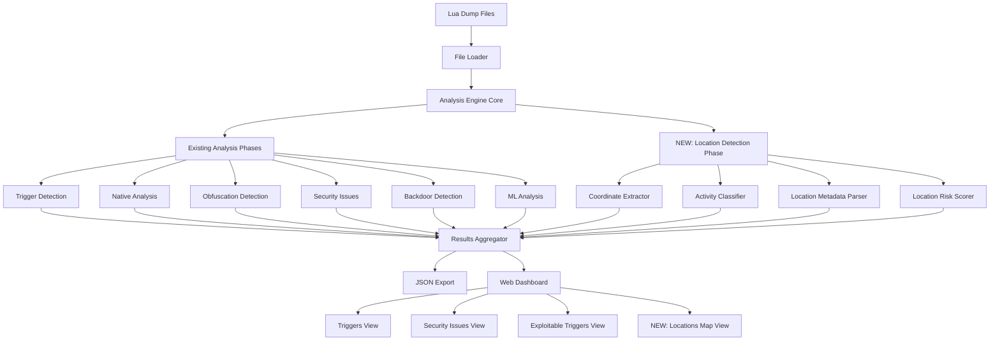
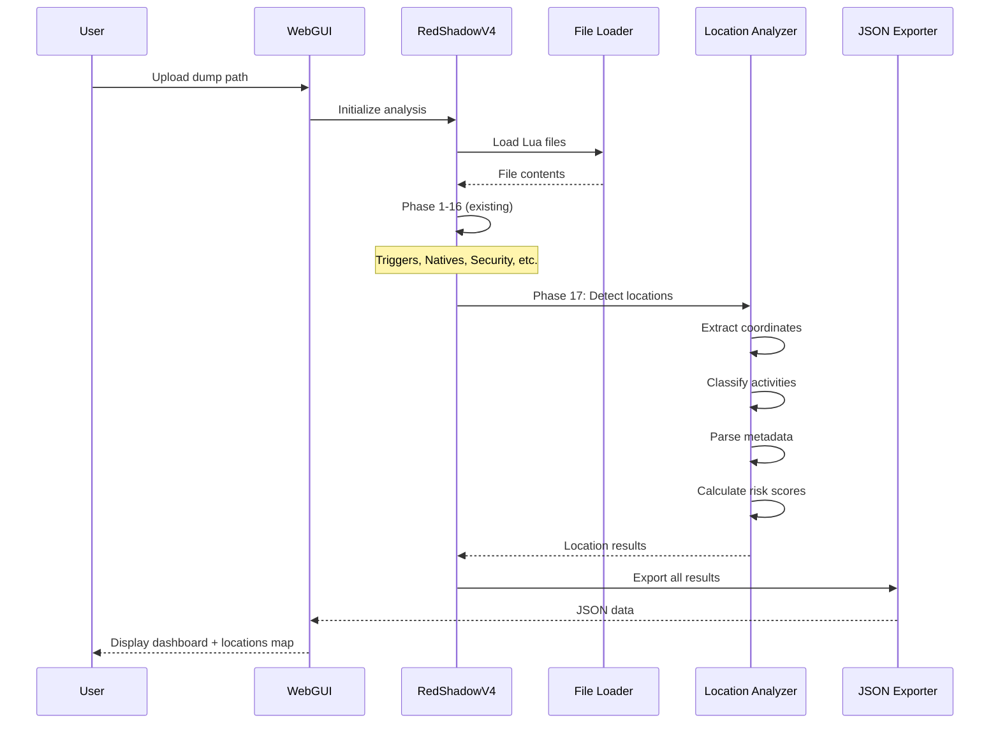

# Design Document: DESTROYER v4 Offline Analysis with RP Location Detection

## Overview

RED-SHADOW DESTROYER v4 is a comprehensive FiveM security analysis tool that performs offline Lua dump analysis without using detectable APIs. The system analyzes server dumps to identify security vulnerabilities, exploitable triggers, obfuscation patterns, and malicious code. This design documents the existing 16-phase analysis engine and introduces a new RP Location Detection feature that identifies important roleplay locations in the code (drug operations, shops, jobs, etc.) by analyzing coordinate patterns and location-based logic.

The new location detection capability enables security analysts to map out server economies, identify high-value exploitation targets, and understand the spatial distribution of server activities—all through static code analysis without runtime detection risks.

## Architecture



## Main Algorithm/Workflow



## Components and Interfaces

### Component 1: RPLocation (Data Model)

**Purpose**: Represents a detected roleplay location with coordinates, activity type, and metadata

**Interface**:
```python
@dataclass
class RPLocation:
    """Represents a detected RP location in the code"""
    coords: Tuple[float, float, float]  # (x, y, z)
    activity_type: str  # "drug_planting", "drug_processing", "drug_selling", etc.
    location_name: str  # Extracted name or auto-generated
    file_path: str  # Source file
    line_number: int  # Line where detected
    confidence: float  # 0.0-1.0 detection confidence
    metadata: Dict[str, Any]  # radius, blip, marker, zone info
    risk_score: float  # 0-100 exploitation risk
    category: str  # "illegal", "legal_job", "service", "shop", etc.
    context_code: str  # Surrounding code snippet
```

**Responsibilities**:
- Store location coordinate data
- Track activity classification
- Maintain detection metadata
- Calculate exploitation risk

### Component 2: LocationDetector

**Purpose**: Main analysis component that detects and classifies RP locations in Lua code

**Interface**:
```python
class LocationDetector:
    def __init__(self, file_contents: Dict[str, str]):
        """Initialize with loaded Lua files"""
        pass
    
    def detect_all_locations(self) -> List[RPLocation]:
        """Run complete location detection pipeline"""
        pass
    
    def extract_coordinates(self, code: str, file_path: str) -> List[Dict]:
        """Extract coordinate patterns from code"""
        pass
    
    def classify_activity(self, location_data: Dict, context: str) -> str:
        """Classify what activity happens at this location"""
        pass
    
    def parse_metadata(self, context: str) -> Dict[str, Any]:
        """Extract location metadata (radius, blip, marker, etc.)"""
        pass
    
    def calculate_risk_score(self, location: RPLocation) -> float:
        """Calculate exploitation risk (0-100)"""
        pass
    
    def categorize_location(self, activity_type: str, metadata: Dict) -> str:
        """Categorize location (illegal, legal_job, service, etc.)"""
        pass
```

**Responsibilities**:
- Coordinate pattern extraction
- Activity type classification
- Metadata parsing
- Risk scoring
- Location categorization

### Component 3: CoordinatePatternMatcher

**Purpose**: Specialized pattern matching for various Lua coordinate formats

**Interface**:
```python
class CoordinatePatternMatcher:
    # Regex patterns for different coordinate formats
    VECTOR3_PATTERN: str
    VECTOR2_PATTERN: str
    COORDS_TABLE_PATTERN: str
    INLINE_COORDS_PATTERN: str
    
    def match_vector3(self, code: str) -> List[Tuple[float, float, float]]:
        """Match vector3(x, y, z) patterns"""
        pass
    
    def match_vector2(self, code: str) -> List[Tuple[float, float]]:
        """Match vector2(x, y) patterns"""
        pass
    
    def match_coords_table(self, code: str) -> List[Dict]:
        """Match {x=..., y=..., z=...} table patterns"""
        pass
    
    def match_config_locations(self, code: str) -> List[Dict]:
        """Match Config.Locations or similar config patterns"""
        pass
    
    def extract_context(self, code: str, match_pos: int, window: int = 10) -> str:
        """Extract surrounding code context for classification"""
        pass
```

**Responsibilities**:
- Pattern matching for all coordinate formats
- Context extraction around matches
- Handling various Lua syntax variations

### Component 4: ActivityClassifier

**Purpose**: Classifies location activity types using keyword analysis and pattern matching

**Interface**:
```python
class ActivityClassifier:
    # Activity keyword mappings
    DRUG_KEYWORDS: Dict[str, List[str]]
    JOB_KEYWORDS: Dict[str, List[str]]
    SHOP_KEYWORDS: Dict[str, List[str]]
    SERVICE_KEYWORDS: Dict[str, List[str]]
    
    def classify(self, context: str, metadata: Dict) -> Tuple[str, float]:
        """Classify activity type with confidence score"""
        pass
    
    def detect_drug_operations(self, context: str) -> Optional[str]:
        """Detect drug-related activities (planting, processing, selling)"""
        pass
    
    def detect_job_activities(self, context: str) -> Optional[str]:
        """Detect legal job activities"""
        pass
    
    def detect_shop_activities(self, context: str) -> Optional[str]:
        """Detect shop/store activities"""
        pass
    
    def detect_service_activities(self, context: str) -> Optional[str]:
        """Detect service locations (ATM, bank, garage, etc.)"""
        pass
```

**Responsibilities**:
- Keyword-based activity detection
- Multi-language support (Spanish/English)
- Confidence scoring
- Activity sub-type detection

### Component 5: LocationDashboard (Web GUI Extension)

**Purpose**: Web interface component for displaying location detection results

**Interface**:
```python
class LocationDashboard:
    def render_locations_tab(self, locations: List[RPLocation]) -> str:
        """Render locations tab HTML"""
        pass
    
    def render_location_map(self, locations: List[RPLocation]) -> str:
        """Render interactive location map/list"""
        pass
    
    def render_location_filters(self) -> str:
        """Render filter controls (by category, activity, risk)"""
        pass
    
    def render_location_card(self, location: RPLocation) -> str:
        """Render individual location card with details"""
        pass
    
    def export_location_coordinates(self, locations: List[RPLocation], format: str) -> str:
        """Export coordinates in various formats (CSV, JSON, Lua)"""
        pass
```

**Responsibilities**:
- HTML rendering for location results
- Interactive filtering and sorting
- Coordinate export functionality
- Visual risk indicators

## Data Models

### Model 1: RPLocation

```python
@dataclass
class RPLocation:
    coords: Tuple[float, float, float]
    activity_type: str
    location_name: str
    file_path: str
    line_number: int
    confidence: float
    metadata: Dict[str, Any]
    risk_score: float
    category: str
    context_code: str
    
    def to_dict(self) -> Dict[str, Any]:
        """Convert to dictionary for JSON export"""
        pass
    
    def get_coordinate_string(self) -> str:
        """Format coordinates as string"""
        pass
    
    def is_high_value_target(self) -> bool:
        """Check if location is high-value for exploitation"""
        return self.risk_score >= 70.0
```

**Validation Rules**:
- coords must be tuple of 3 floats
- activity_type must be non-empty string
- confidence must be between 0.0 and 1.0
- risk_score must be between 0.0 and 100.0
- category must be one of: "illegal", "legal_job", "service", "shop", "unknown"

### Model 2: LocationMetadata

```python
@dataclass
class LocationMetadata:
    radius: Optional[float] = None
    blip_sprite: Optional[int] = None
    blip_color: Optional[int] = None
    blip_name: Optional[str] = None
    marker_type: Optional[int] = None
    marker_color: Optional[Tuple[int, int, int, int]] = None
    zone_name: Optional[str] = None
    interaction_key: Optional[str] = None
    draw_distance: Optional[float] = None
    additional_data: Dict[str, Any] = field(default_factory=dict)
```

**Validation Rules**:
- radius must be positive if present
- blip_sprite/color must be valid FiveM blip IDs if present
- marker_type must be valid FiveM marker type if present
- marker_color must be RGBA tuple if present

## Algorithmic Pseudocode

### Main Location Detection Algorithm

```python
def detect_all_locations(file_contents: Dict[str, str]) -> List[RPLocation]:
    """
    Main algorithm for detecting all RP locations in Lua dump
    
    INPUT: file_contents - Dictionary mapping file paths to Lua code
    OUTPUT: List of detected RPLocation objects
    """
    locations = []
    pattern_matcher = CoordinatePatternMatcher()
    activity_classifier = ActivityClassifier()
    
    # Iterate through all Lua files
    for file_path, code in file_contents.items():
        # Skip non-relevant files
        if should_skip_file(file_path):
            continue
        
        # Extract all coordinate patterns
        coord_matches = pattern_matcher.extract_all_patterns(code, file_path)
        
        # Process each coordinate match
        for match in coord_matches:
            # Extract surrounding context
            context = pattern_matcher.extract_context(
                code, 
                match['position'], 
                window=10
            )
            
            # Classify activity type
            activity_type, confidence = activity_classifier.classify(
                context, 
                match['metadata']
            )
            
            # Parse additional metadata
            metadata = parse_location_metadata(context)
            
            # Determine location name
            location_name = extract_location_name(context, match) or \
                           generate_location_name(activity_type, match['coords'])
            
            # Categorize location
            category = categorize_location(activity_type, metadata)
            
            # Calculate risk score
            risk_score = calculate_location_risk(
                activity_type, 
                category, 
                metadata, 
                context
            )
            
            # Create RPLocation object
            location = RPLocation(
                coords=match['coords'],
                activity_type=activity_type,
                location_name=location_name,
                file_path=file_path,
                line_number=match['line_number'],
                confidence=confidence,
                metadata=metadata,
                risk_score=risk_score,
                category=category,
                context_code=context
            )
            
            locations.append(location)
    
    # Post-processing: deduplicate nearby locations
    locations = deduplicate_locations(locations, distance_threshold=5.0)
    
    # Sort by risk score (highest first)
    locations.sort(key=lambda loc: loc.risk_score, reverse=True)
    
    return locations
```

**Preconditions:**
- file_contents is a non-empty dictionary
- All file paths in file_contents are valid strings
- All code values are valid Lua code strings

**Postconditions:**
- Returns list of RPLocation objects
- All locations have valid coordinates
- Locations are sorted by risk score (descending)
- No duplicate locations within distance_threshold
- All location objects pass validation rules

**Loop Invariants:**
- All previously processed locations are valid RPLocation objects
- locations list contains no duplicates at same coordinates
- All locations have risk_score between 0.0 and 100.0

### Coordinate Extraction Algorithm

```python
def extract_all_patterns(code: str, file_path: str) -> List[Dict]:
    """
    Extract all coordinate patterns from Lua code
    
    INPUT: code - Lua source code string, file_path - source file path
    OUTPUT: List of coordinate match dictionaries
    """
    matches = []
    
    # Pattern 1: vector3(x, y, z)
    vector3_pattern = r'vector3\s*\(\s*(-?\d+\.?\d*)\s*,\s*(-?\d+\.?\d*)\s*,\s*(-?\d+\.?\d*)\s*\)'
    for match in re.finditer(vector3_pattern, code, re.IGNORECASE):
        x, y, z = float(match.group(1)), float(match.group(2)), float(match.group(3))
        line_num = code[:match.start()].count('\n') + 1
        matches.append({
            'coords': (x, y, z),
            'position': match.start(),
            'line_number': line_num,
            'pattern_type': 'vector3',
            'metadata': {}
        })
    
    # Pattern 2: vector2(x, y) - convert to 3D with z=0
    vector2_pattern = r'vector2\s*\(\s*(-?\d+\.?\d*)\s*,\s*(-?\d+\.?\d*)\s*\)'
    for match in re.finditer(vector2_pattern, code, re.IGNORECASE):
        x, y = float(match.group(1)), float(match.group(2))
        line_num = code[:match.start()].count('\n') + 1
        matches.append({
            'coords': (x, y, 0.0),
            'position': match.start(),
            'line_number': line_num,
            'pattern_type': 'vector2',
            'metadata': {}
        })
    
    # Pattern 3: Table format {x=..., y=..., z=...}
    table_pattern = r'\{\s*x\s*=\s*(-?\d+\.?\d*)\s*,\s*y\s*=\s*(-?\d+\.?\d*)\s*,\s*z\s*=\s*(-?\d+\.?\d*)\s*\}'
    for match in re.finditer(table_pattern, code, re.IGNORECASE):
        x, y, z = float(match.group(1)), float(match.group(2)), float(match.group(3))
        line_num = code[:match.start()].count('\n') + 1
        matches.append({
            'coords': (x, y, z),
            'position': match.start(),
            'line_number': line_num,
            'pattern_type': 'table',
            'metadata': {}
        })
    
    # Pattern 4: Config.Locations arrays
    config_pattern = r'(Config\.Locations|Config\.Zones|Locations)\s*=\s*\{'
    for match in re.finditer(config_pattern, code, re.IGNORECASE):
        # Extract the entire config block
        block = extract_balanced_braces(code, match.end() - 1)
        # Parse individual locations within the block
        block_matches = extract_all_patterns(block, file_path)
        for block_match in block_matches:
            block_match['metadata']['config_block'] = True
            matches.append(block_match)
    
    return matches
```

**Preconditions:**
- code is a valid string (may be empty)
- file_path is a valid string

**Postconditions:**
- Returns list of match dictionaries
- Each match has 'coords', 'position', 'line_number', 'pattern_type', 'metadata'
- All coordinates are valid float tuples
- Line numbers are positive integers
- No duplicate matches at same position

**Loop Invariants:**
- All matches in list have valid coordinate tuples
- All matches have unique positions in code
- All line numbers are accurate

### Activity Classification Algorithm

```python
def classify_activity(context: str, metadata: Dict) -> Tuple[str, float]:
    """
    Classify location activity type using keyword analysis
    
    INPUT: context - surrounding code, metadata - location metadata
    OUTPUT: (activity_type, confidence_score)
    """
    context_lower = context.lower()
    
    # Drug operation keywords (Spanish and English)
    drug_keywords = {
        'planting': ['plantar', 'plant', 'sembrar', 'cultivar', 'grow', 'seed'],
        'processing': ['procesar', 'process', 'empaquetar', 'package', 'refinar', 'refine'],
        'selling': ['vender', 'sell', 'dealer', 'comprar', 'buy', 'trade']
    }
    
    # Check for drug operations (highest priority)
    for operation, keywords in drug_keywords.items():
        keyword_count = sum(1 for kw in keywords if kw in context_lower)
        if keyword_count > 0:
            confidence = min(0.6 + (keyword_count * 0.15), 1.0)
            return (f"drug_{operation}", confidence)
    
    # Job keywords
    job_keywords = {
        'mining': ['mina', 'mine', 'minero', 'miner', 'pickaxe'],
        'fishing': ['pesca', 'fish', 'pescador', 'fisher', 'rod'],
        'farming': ['granja', 'farm', 'granjero', 'farmer', 'harvest'],
        'trucking': ['camion', 'truck', 'delivery', 'entrega'],
        'taxi': ['taxi', 'cab', 'passenger'],
        'mechanic': ['mecanico', 'mechanic', 'repair', 'reparar']
    }
    
    for job_type, keywords in job_keywords.items():
        keyword_count = sum(1 for kw in keywords if kw in context_lower)
        if keyword_count > 0:
            confidence = min(0.5 + (keyword_count * 0.15), 0.95)
            return (f"job_{job_type}", confidence)
    
    # Shop keywords
    shop_keywords = {
        'weapon': ['arma', 'weapon', 'gun', 'pistol', 'rifle'],
        'clothing': ['ropa', 'cloth', 'outfit', 'vestir'],
        'vehicle': ['vehiculo', 'vehicle', 'car', 'coche', 'dealership'],
        'general': ['tienda', 'shop', 'store', 'market', 'compra']
    }
    
    for shop_type, keywords in shop_keywords.items():
        keyword_count = sum(1 for kw in keywords if kw in context_lower)
        if keyword_count > 0:
            confidence = min(0.5 + (keyword_count * 0.15), 0.95)
            return (f"shop_{shop_type}", confidence)
    
    # Service keywords
    service_keywords = {
        'atm': ['atm', 'cajero', 'cash'],
        'bank': ['banco', 'bank', 'deposit'],
        'garage': ['garaje', 'garage', 'parking'],
        'hospital': ['hospital', 'doctor', 'medic', 'ems'],
        'police': ['policia', 'police', 'comisaria', 'station']
    }
    
    for service_type, keywords in service_keywords.items():
        keyword_count = sum(1 for kw in keywords if kw in context_lower)
        if keyword_count > 0:
            confidence = min(0.5 + (keyword_count * 0.15), 0.95)
            return (f"service_{service_type}", confidence)
    
    # Default: unknown with low confidence
    return ("unknown", 0.3)
```

**Preconditions:**
- context is a non-empty string
- metadata is a dictionary (may be empty)

**Postconditions:**
- Returns tuple of (activity_type, confidence)
- activity_type is a non-empty string
- confidence is between 0.0 and 1.0
- Drug operations have highest priority in classification
- Unknown activities have confidence <= 0.3

**Loop Invariants:**
- keyword_count is non-negative
- confidence never exceeds 1.0
- First matching category is returned (priority order maintained)

### Risk Scoring Algorithm

```python
def calculate_location_risk(activity_type: str, category: str, 
                           metadata: Dict, context: str) -> float:
    """
    Calculate exploitation risk score for a location
    
    INPUT: activity_type, category, metadata, context
    OUTPUT: risk_score (0.0-100.0)
    """
    risk_score = 0.0
    
    # Base risk by category
    category_risk = {
        'illegal': 50.0,      # High base risk
        'legal_job': 20.0,    # Medium base risk
        'shop': 15.0,         # Low-medium base risk
        'service': 10.0,      # Low base risk
        'unknown': 5.0        # Very low base risk
    }
    risk_score += category_risk.get(category, 5.0)
    
    # Activity-specific risk modifiers
    if 'drug' in activity_type:
        risk_score += 30.0  # Drug operations are high-value targets
    
    if 'weapon' in activity_type:
        risk_score += 20.0  # Weapon shops are valuable
    
    if 'bank' in activity_type or 'atm' in activity_type:
        risk_score += 15.0  # Financial services are targets
    
    # Check for security measures (reduce risk if present)
    security_indicators = ['permission', 'check', 'validate', 'auth', 'admin']
    security_count = sum(1 for indicator in security_indicators 
                        if indicator in context.lower())
    risk_score -= (security_count * 5.0)
    
    # Check for exploitable patterns (increase risk)
    exploitable_patterns = ['TriggerServerEvent', 'RegisterNetEvent', 'AddEventHandler']
    exploit_count = sum(1 for pattern in exploitable_patterns 
                       if pattern in context)
    risk_score += (exploit_count * 10.0)
    
    # Metadata-based adjustments
    if metadata.get('radius', 0) > 50.0:
        risk_score += 5.0  # Large interaction radius = easier to exploit
    
    if metadata.get('blip_sprite'):
        risk_score += 5.0  # Visible on map = known location
    
    # Clamp to valid range
    risk_score = max(0.0, min(100.0, risk_score))
    
    return risk_score
```

**Preconditions:**
- activity_type is a non-empty string
- category is a valid category string
- metadata is a dictionary (may be empty)
- context is a non-empty string

**Postconditions:**
- Returns float between 0.0 and 100.0
- Drug operations always score >= 50.0
- Locations with security measures have reduced scores
- Locations with exploitable patterns have increased scores

**Loop Invariants:**
- risk_score remains a valid float throughout calculation
- All additions/subtractions maintain numeric validity
- Final score is clamped to [0.0, 100.0]

## Key Functions with Formal Specifications

### Function 1: detect_all_locations()

```python
def detect_all_locations(self) -> List[RPLocation]:
    """
    Main entry point for location detection phase
    Integrates into RedShadowV4 analysis pipeline as Phase 17
    """
    pass
```

**Preconditions:**
- self.file_contents is populated with Lua files
- self.file_contents is a non-empty dictionary
- All file paths are valid strings
- All code values are valid strings

**Postconditions:**
- Returns list of RPLocation objects
- All locations have valid coordinates (3-tuple of floats)
- All locations have risk_score between 0.0 and 100.0
- All locations have confidence between 0.0 and 1.0
- List is sorted by risk_score (descending)
- No duplicate locations within 5.0 unit distance
- self.rp_locations attribute is populated

**Loop Invariants:** N/A (delegates to algorithm)

### Function 2: extract_coordinates()

```python
def extract_coordinates(self, code: str, file_path: str) -> List[Dict]:
    """
    Extract all coordinate patterns from Lua code
    Supports: vector3, vector2, table format, Config.Locations
    """
    pass
```

**Preconditions:**
- code is a valid string (may be empty)
- file_path is a valid string

**Postconditions:**
- Returns list of coordinate match dictionaries
- Each match contains: coords, position, line_number, pattern_type, metadata
- All coords are valid 3-tuples of floats
- All line_numbers are positive integers
- All positions are valid indices in code
- No duplicate matches at same position

**Loop Invariants:**
- All processed matches have valid coordinate tuples
- All matches have unique positions
- Line numbers are monotonically increasing

### Function 3: classify_activity()

```python
def classify_activity(self, location_data: Dict, context: str) -> str:
    """
    Classify what activity happens at this location
    Uses keyword analysis and pattern matching
    """
    pass
```

**Preconditions:**
- location_data is a non-empty dictionary with 'coords' key
- context is a non-empty string
- context contains valid Lua code

**Postconditions:**
- Returns non-empty activity type string
- Activity type follows format: "{category}_{subcategory}" or "unknown"
- Drug operations are prioritized over other activities
- Classification is deterministic for same inputs

**Loop Invariants:**
- Keyword matching maintains priority order
- First match is returned (no further processing)

### Function 4: calculate_risk_score()

```python
def calculate_risk_score(self, location: RPLocation) -> float:
    """
    Calculate exploitation risk score (0-100)
    Based on activity type, category, security measures, exploitable patterns
    """
    pass
```

**Preconditions:**
- location is a valid RPLocation object
- location.activity_type is non-empty
- location.category is valid category string
- location.context_code is non-empty

**Postconditions:**
- Returns float between 0.0 and 100.0
- Drug operations score >= 50.0
- Locations with security measures have reduced scores
- Locations with exploitable patterns have increased scores
- Score is deterministic for same location

**Loop Invariants:**
- risk_score remains valid float throughout
- Score never exceeds bounds during calculation

### Function 5: deduplicate_locations()

```python
def deduplicate_locations(locations: List[RPLocation], 
                         distance_threshold: float = 5.0) -> List[RPLocation]:
    """
    Remove duplicate locations within distance threshold
    Keeps location with highest risk score
    """
    pass
```

**Preconditions:**
- locations is a list (may be empty)
- All elements are valid RPLocation objects
- distance_threshold is positive float

**Postconditions:**
- Returns list with no locations within distance_threshold of each other
- For each duplicate group, highest risk_score location is kept
- Original order is preserved for non-duplicates
- Returned list length <= input list length

**Loop Invariants:**
- All locations in result are unique (no duplicates within threshold)
- Highest risk location is always selected from duplicate groups
- No valid locations are incorrectly removed

## Example Usage

```python
# Example 1: Basic location detection integration
from red_shadow_destroyer_v4 import RedShadowV4

# Initialize engine with dump path
engine = RedShadowV4("/path/to/server/dump")

# Load files
file_count = engine.load_files()
print(f"Loaded {file_count} Lua files")

# Run all analysis phases (including new Phase 17: Location Detection)
engine.extract_functions()
engine.detect_triggers()
engine.detect_obfuscation()
engine.analyze_natives()
engine.analyze_callbacks()
engine.detect_security_issues()
engine.fingerprint_anticheats()
engine.analyze_manifests()
engine.analyze_trigger_chains()
engine.detect_code_clones()
engine.analyze_code_entropy()
engine.analyze_code_complexity()
engine.detect_backdoors()
engine.detect_behavioral_anomalies()
engine.apply_ml_analysis()
engine.detect_advanced_patterns()
engine.detect_all_locations()  # NEW: Phase 17

# Access location results
print(f"\nDetected {len(engine.rp_locations)} RP locations")

# Filter high-risk locations
high_risk = [loc for loc in engine.rp_locations if loc.risk_score >= 70.0]
print(f"High-risk locations: {len(high_risk)}")

# Filter drug operations
drug_locations = [loc for loc in engine.rp_locations 
                  if 'drug' in loc.activity_type]
print(f"Drug operation locations: {len(drug_locations)}")

# Export results
engine.export_json("analysis_results.json")
```

```python
# Example 2: Standalone location detection
from red_shadow_destroyer_v4 import LocationDetector

# Load Lua files
file_contents = {
    "esx_drugs/client.lua": open("dump/esx_drugs/client.lua").read(),
    "esx_shops/config.lua": open("dump/esx_shops/config.lua").read()
}

# Initialize detector
detector = LocationDetector(file_contents)

# Detect locations
locations = detector.detect_all_locations()

# Analyze results
for loc in locations:
    print(f"\n{loc.location_name}")
    print(f"  Coords: {loc.coords}")
    print(f"  Activity: {loc.activity_type}")
    print(f"  Category: {loc.category}")
    print(f"  Risk: {loc.risk_score:.1f}/100")
    print(f"  File: {loc.file_path}:{loc.line_number}")
    
    if loc.is_high_value_target():
        print(f"  ⚠️  HIGH-VALUE EXPLOITATION TARGET")
```

```python
# Example 3: Web dashboard with locations
from web_gui import launch_web_gui

# Run analysis and launch GUI
engine = RedShadowV4("/path/to/dump")
# ... run all phases ...
engine.detect_all_locations()

# Launch web interface (includes new Locations tab)
launch_web_gui(engine, auto_open=True)
# Dashboard now shows:
# - Triggers tab
# - Security Issues tab
# - Exploitable Triggers tab
# - Locations tab (NEW) with map/list view
```

```python
# Example 4: Export location coordinates
from red_shadow_destroyer_v4 import RedShadowV4

engine = RedShadowV4("/path/to/dump")
# ... run analysis ...

# Export as CSV for mapping tools
with open("locations.csv", "w") as f:
    f.write("name,x,y,z,activity,risk\n")
    for loc in engine.rp_locations:
        x, y, z = loc.coords
        f.write(f"{loc.location_name},{x},{y},{z},{loc.activity_type},{loc.risk_score}\n")

# Export as Lua for in-game visualization
with open("locations.lua", "w") as f:
    f.write("Locations = {\n")
    for i, loc in enumerate(engine.rp_locations):
        x, y, z = loc.coords
        f.write(f"    [{i+1}] = {{coords = vector3({x}, {y}, {z}), ")
        f.write(f"name = '{loc.location_name}', type = '{loc.activity_type}'}},\n")
    f.write("}\n")
```

## Correctness Properties

### Property 1: Coordinate Validity
```python
# All detected locations must have valid 3D coordinates
assert all(
    isinstance(loc.coords, tuple) and 
    len(loc.coords) == 3 and
    all(isinstance(c, float) for c in loc.coords)
    for loc in engine.rp_locations
)
```

### Property 2: Risk Score Bounds
```python
# All risk scores must be within valid range
assert all(
    0.0 <= loc.risk_score <= 100.0
    for loc in engine.rp_locations
)
```

### Property 3: Drug Operations High Risk
```python
# Drug operations must always be high-risk (>= 50.0)
assert all(
    loc.risk_score >= 50.0
    for loc in engine.rp_locations
    if 'drug' in loc.activity_type
)
```

### Property 4: No Duplicate Locations
```python
# No two locations should be within 5.0 units of each other
from itertools import combinations
import math

def distance_3d(coords1, coords2):
    return math.sqrt(sum((a - b) ** 2 for a, b in zip(coords1, coords2)))

assert all(
    distance_3d(loc1.coords, loc2.coords) >= 5.0
    for loc1, loc2 in combinations(engine.rp_locations, 2)
)
```

### Property 5: Confidence Bounds
```python
# All confidence scores must be between 0.0 and 1.0
assert all(
    0.0 <= loc.confidence <= 1.0
    for loc in engine.rp_locations
)
```

### Property 6: Activity Type Non-Empty
```python
# All locations must have a non-empty activity type
assert all(
    loc.activity_type and len(loc.activity_type) > 0
    for loc in engine.rp_locations
)
```

### Property 7: Valid Category
```python
# All locations must have a valid category
valid_categories = {'illegal', 'legal_job', 'service', 'shop', 'unknown'}
assert all(
    loc.category in valid_categories
    for loc in engine.rp_locations
)
```

### Property 8: High-Value Target Consistency
```python
# is_high_value_target() must be consistent with risk_score
assert all(
    loc.is_high_value_target() == (loc.risk_score >= 70.0)
    for loc in engine.rp_locations
)
```

## Error Handling

### Error Scenario 1: Invalid Coordinate Format

**Condition**: Regex matches coordinate pattern but values are not valid numbers
**Response**: Skip the match, log warning, continue processing
**Recovery**: System continues with remaining coordinate patterns

### Error Scenario 2: Empty File Contents

**Condition**: file_contents dictionary is empty or all files are empty
**Response**: Return empty location list, log info message
**Recovery**: Analysis completes successfully with zero locations

### Error Scenario 3: Malformed Lua Code

**Condition**: Code contains syntax errors or unparseable structures
**Response**: Extract what's possible, skip problematic sections
**Recovery**: Partial results returned, errors logged

### Error Scenario 4: Missing Context

**Condition**: Coordinate found but surrounding context is insufficient
**Response**: Use default classification ("unknown"), lower confidence
**Recovery**: Location still added with reduced confidence score

### Error Scenario 5: Duplicate Detection Failure

**Condition**: Distance calculation fails due to invalid coordinates
**Response**: Skip deduplication for problematic pair, log warning
**Recovery**: Continue with remaining deduplication checks

## Testing Strategy

### Unit Testing Approach

Test each component in isolation:

1. **CoordinatePatternMatcher Tests**
   - Test each regex pattern independently
   - Verify correct extraction of x, y, z values
   - Test edge cases: negative coords, decimals, scientific notation
   - Test malformed patterns are rejected

2. **ActivityClassifier Tests**
   - Test keyword matching for each activity type
   - Test priority ordering (drugs > jobs > shops > services)
   - Test multi-language support (Spanish/English)
   - Test confidence score calculation
   - Test unknown classification fallback

3. **Risk Scoring Tests**
   - Test base risk by category
   - Test activity-specific modifiers
   - Test security measure detection
   - Test exploitable pattern detection
   - Test score clamping to [0, 100]

4. **Deduplication Tests**
   - Test distance calculation
   - Test duplicate removal
   - Test highest risk selection
   - Test threshold boundary conditions

### Property-Based Testing Approach

**Property Test Library**: hypothesis (Python)

1. **Coordinate Extraction Properties**
   - Generated Lua code with random coordinates always extracts valid tuples
   - Extracted coordinates match input values within floating-point precision
   - Line numbers are always positive and within file bounds

2. **Risk Score Properties**
   - Risk score is always in [0, 100] regardless of inputs
   - Drug operations always score >= 50
   - Adding security measures always reduces or maintains score
   - Score is deterministic for same inputs

3. **Deduplication Properties**
   - Output length <= input length
   - No locations in output are within threshold distance
   - All locations in output were in input (no new locations created)
   - Highest risk location is always kept from duplicate groups

### Integration Testing Approach

1. **Full Pipeline Test**
   - Load real FiveM server dump
   - Run complete analysis including location detection
   - Verify locations are detected in known files
   - Verify JSON export includes location data
   - Verify web dashboard displays locations

2. **Web GUI Integration**
   - Test location tab rendering
   - Test filtering by category/activity/risk
   - Test coordinate export functionality
   - Test location card display

3. **Performance Testing**
   - Test with large dumps (1000+ files)
   - Verify reasonable execution time (< 5 minutes)
   - Verify memory usage stays reasonable
   - Test concurrent analysis requests

## Performance Considerations

1. **Regex Optimization**
   - Compile regex patterns once at initialization
   - Use non-capturing groups where possible
   - Limit backtracking with atomic groups

2. **File Filtering**
   - Skip non-Lua files early
   - Skip files without coordinate patterns (quick pre-scan)
   - Process files in parallel if needed

3. **Deduplication Efficiency**
   - Use spatial indexing (k-d tree) for large location sets
   - Early termination when no duplicates found
   - Cache distance calculations

4. **Memory Management**
   - Stream large files instead of loading entirely
   - Limit context window size
   - Clear intermediate data structures

## Security Considerations

1. **Offline Analysis**
   - No network requests (maintains undetectable operation)
   - No API calls to external services
   - All analysis is local and static

2. **Data Privacy**
   - Dump files may contain sensitive server data
   - Results should be stored securely
   - Export functionality should warn about data sensitivity

3. **Code Injection Prevention**
   - Never execute analyzed Lua code
   - Sanitize all extracted strings before display
   - Validate all coordinate values before use

4. **False Positive Management**
   - Clearly indicate confidence scores
   - Allow manual verification of detections
   - Provide context code for validation

## Dependencies

### Existing Dependencies (from DESTROYER v4)
- Python 3.8+
- re (regex) - standard library
- json - standard library
- pathlib - standard library
- dataclasses - standard library
- typing - standard library
- collections - standard library
- math - standard library
- hashlib - standard library
- difflib - standard library
- http.server - standard library (for web GUI)
- threading - standard library (for web GUI)
- webbrowser - standard library (for web GUI)

### New Dependencies (for Location Detection)
- No new external dependencies required
- All functionality uses Python standard library
- Maintains zero-dependency offline operation

### Optional Dependencies
- hypothesis - for property-based testing (dev only)
- pytest - for unit testing (dev only)
